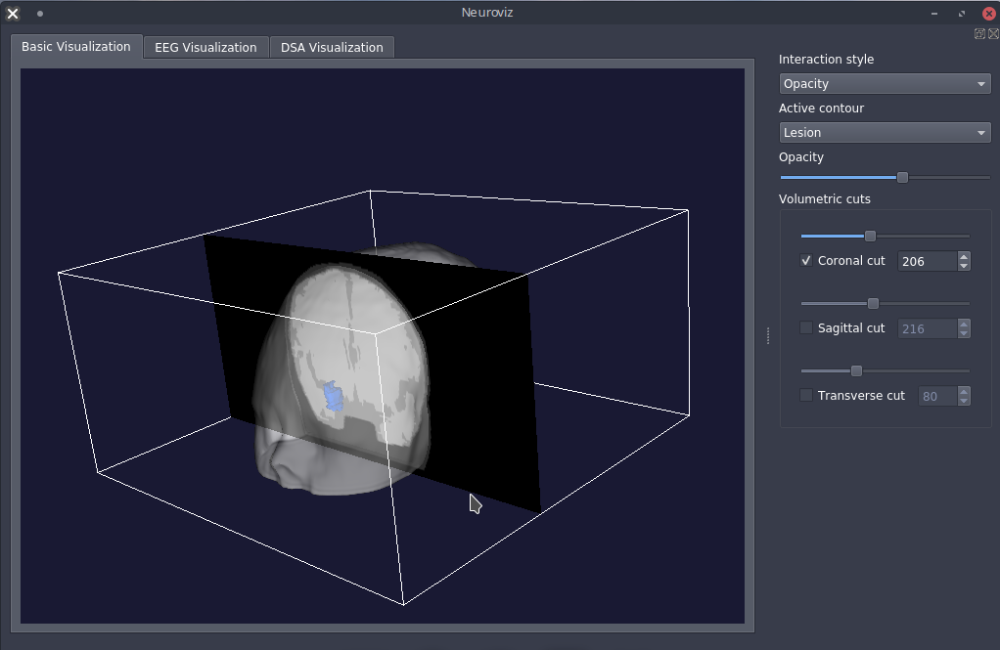
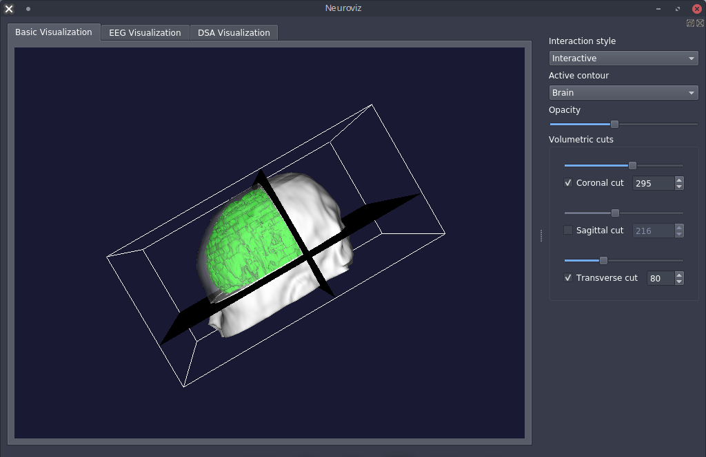
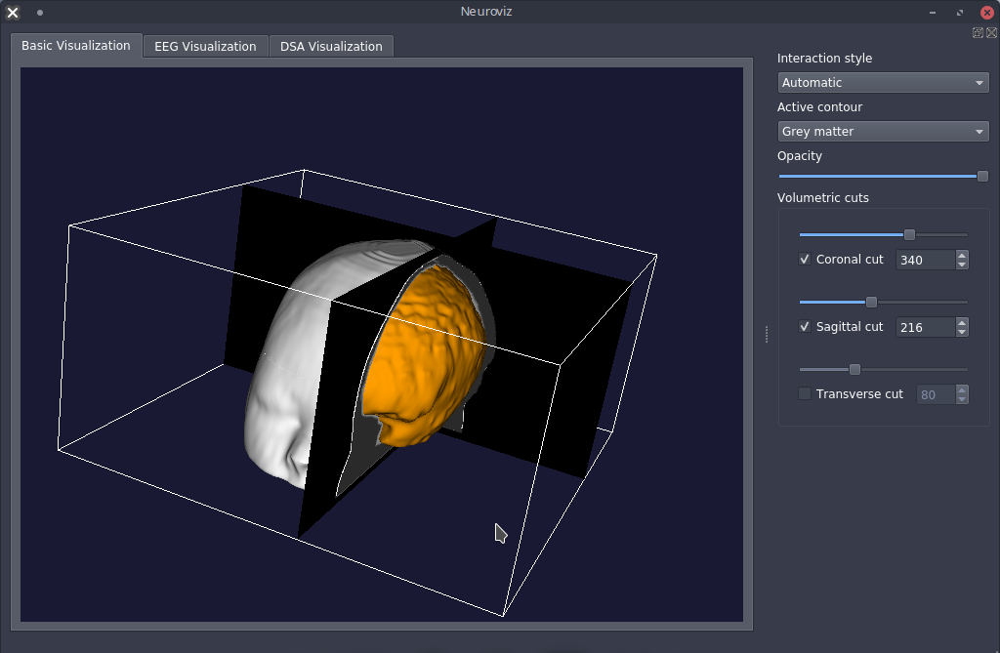
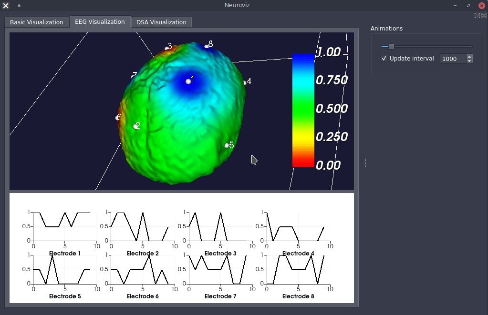
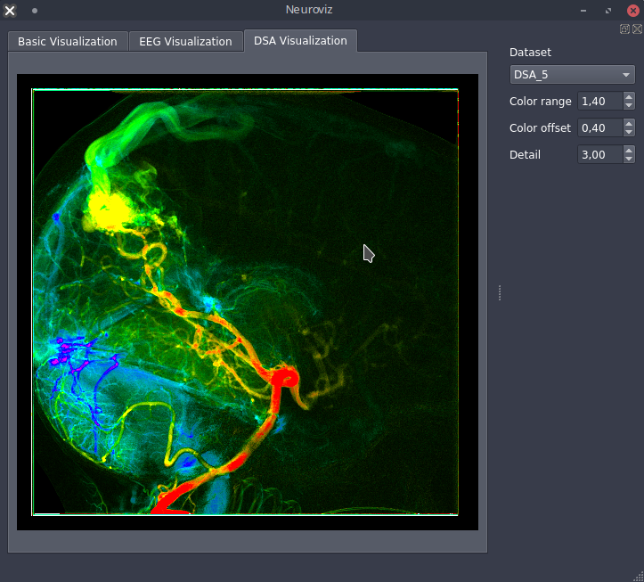

# Neuroviz

Neuroimaging Visualization Tool using VTK 8.2.0 and PyQt 5.9.2.

## Screenshots

Screenshot of "Basic Visualization" scene in "Opacity", "Interactive" and "Automatics" mode:

Screenshot of "EEG Visualization" and "DSA" scene:

